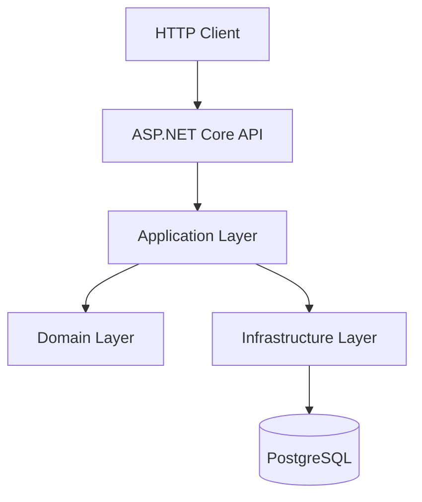
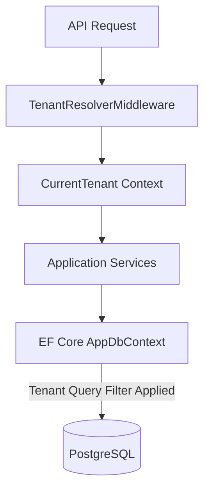

# Inventory Management System API

A RESTful backend API for managing products, inventory, sales, purchases, customers, suppliers, reporting, and multi-tenant business operations.

## Overview

The Inventory Management System API is an enterprise backend designed to manage core business operations such as stock tracking, sales, and supply chain management. The API is built using ASP.NET Core 10, following Clean Architecture principles. It uses PostgreSQL for data persistence, Entity Framework Core for data access, and provides strong multi-tenant data isolation. Authentication is secured via JWT and ASP.NET Core Identity. 

## Key Features

### Authentication & Authorization
- User authentication via ASP.NET Core Identity
- JWT access tokens and refresh tokens
- Role-based authorization
- Brute-force lockout protection
- Password policy enforcement

### Multi-Tenancy
- Strict tenant data isolation
- Tenant-aware data access and query filtering
- Middleware-based tenant resolution
- Automatic tenant assignment on entity creation

### Product Management
- Product CRUD operations
- Category management
- Image uploading
- Soft deletion support

### Inventory
- Stock tracking via inventory transactions
- Low-stock threshold definitions

### Sales & Purchases
- Sales transactions and sale items management
- Customer management
- Purchase tracking and purchase items
- Supplier management

### Reporting & Notifications
- PDF report generation using QuestPDF
- Real-time notifications via SignalR hubs
- WebPush subscriptions

## Technology Stack

| Category          | Technology |
|-------------------|------------|
| Language          | C# 14 (.NET 10.0) |
| Framework         | ASP.NET Core 10.0 |
| ORM               | Entity Framework Core 10.0 |
| Database          | PostgreSQL |
| Database Provider | Npgsql 10.0.3 |
| Authentication    | ASP.NET Core Identity, JWT |
| Mediator          | MediatR |
| API Documentation | OpenAPI, Scalar |
| PDF Generation    | QuestPDF |
| Notifications     | SignalR, WebPush |

## Architecture

The backend implements Clean Architecture, ensuring separation of concerns and dependency inversion.

```text
Inventory-Management.Api
        │
        ▼
Inventory-Management.Application
        │
        ▼
Inventory-Management.Domain
        ▲
        │
Inventory-Management.Infrastructure
```

### Domain Layer
Contains enterprise logic, including domain entities (`AppUser`, `Product`, `Sale`, etc.), enums, and common interfaces (`IMultiTenant`, `ISoftDelete`).

### Application Layer
Contains business use cases, Application Services (`SaleService`, `ProductService`, etc.), MediatR configurations

### Infrastructure Layer
Implements data access via EF Core and Npgsql, Generic and specific Repositories, Identity configuration, Bogus for data seeding, and File Storage implementations.

### API Layer
Serves as the entry point. Contains HTTP Controllers, Rate Limiting configuration, CORS, tenant resolution middleware, global exception handling (ProblemDetails), and SignalR hubs.

## Architecture Diagram



## Project Structure

```text
Inventory-Management/
│
├── Inventory-Management.Api/
├── Inventory-Management.Application/
├── Inventory-Management.Domain/
├── Inventory-Management.Infrastructure/
│
└── Inventory-Management.slnx
```

## Core Modules

- **Auth & Users**: Manages user registration, login, JWT token generation, refresh tokens, and roles.
- **Tenants**: Manages tenant isolation, configuration, and status.
- **Products & Categories**: Handles product catalog, SKUs, pricing, and categorizations.
- **Inventory**: Tracks stock movements and thresholds via `InventoryTransaction`.
- **Sales**: Manages customer sales transactions and items.
- **Purchases**: Manages supplier purchase orders and items.
- **Customers & Suppliers**: Manages external entities engaged in sales and purchases.
- **Reports**: Generates business data summaries and PDF exports.
- **Notifications**: Handles real-time system alerts via SignalR and WebPush.

## Authentication & Authorization

Authentication is handled via JWT and ASP.NET Core Identity.

```text
Login Request
       ↓
Credential & Lockout Validation
       ↓
Generate Access Token + Refresh Token
       ↓
Authenticated API Request (Bearer Token or Cookie)
       ↓
Role-Based Authorization
       ↓
Endpoint Execution
```

## Multi-Tenancy

Tenant isolation is deeply integrated into the architecture.

- `IMultiTenant` interface marks tenant-aware entities.
- `TenantResolverMiddleware` extracts the tenant context from the request.
- Entity Framework Core applies a **Global Query Filter** automatically to restrict data access to the current tenant context.
- When creating new entities, `AppDbContext` automatically assigns the current `TenantId`.



## Database

The application uses PostgreSQL with EF Core.

Important Entities:
- `AppUser`
- `Tenant`
- `Product`
- `Category`
- `InventoryTransaction`
- `Sale`
- `SaleItem`
- `Purchase`
- `PurchaseItem`
- `Customer`
- `Supplier`
- `Notification`
- `PushSubscription`
- `RefreshToken`

## Business Rules

### Soft Delete
Entities implementing `ISoftDelete` (e.g., `Product`) are never permanently deleted.
- When a delete operation is requested, `AppDbContext` intercepts `SaveChanges`.
- `EntityState.Deleted` is converted to `EntityState.Modified`.
- `IsDeleted` is set to `true` and `DeletedAt` is recorded.
- Global query filters ensure deleted records are excluded from standard queries.

## API Documentation

The API exposes an OpenAPI specification and interactive API documentation through Scalar.

After starting the application, use the configured API documentation endpoint to explore and test available endpoints.

## Prerequisites

- .NET 10.0 SDK
- PostgreSQL
- Git

Verify installations:
```bash
dotnet --version
psql --version
git --version
```

## Installation

1. Clone the repository:
```bash
git clone https://github.com/Eyob73/Inventory-Management.git
cd Inventory-Management
```

2. Restore dependencies:
```bash
dotnet restore Inventory-Management.slnx
```

## Configuration

The API requires configuration in `appsettings.Development.json` or `appsettings.json`.

```json
{
  "ConnectionStrings": {
    "DefaultConnection": "Host=localhost;Port=5432;Database=InventoryManagementDb;Username=postgres;Password=YOUR_PASSWORD",
    "ImsDbConnectionString": "Host=localhost;Port=5432;Database=InventoryManagementDb;Username=postgres;Password=YOUR_PASSWORD"
  },
  "Jwt": {
    "Issuer": "https://localhost:5001",
    "Audience": "tms-client",
    "Key": "YOUR_SUPER_SECRET_KEY_HERE",
    "ExpiryMinutes": 15
  },
  "AllowedOrigins": [
    "http://localhost:4200"
  ]
}
```

> **Security Warning**: Never commit passwords, JWT secrets, database credentials, API keys, or other sensitive configuration to source control. Use Environment Variables or .NET User Secrets in development.

## Database Migrations

Entity Framework Core migrations manage the database schema.

To create a new migration:
```bash
dotnet ef migrations add MigrationName --project Inventory-Management.Infrastructure --startup-project Inventory-Management.Api
```

To update the database:
```bash
dotnet ef database update --project Inventory-Management.Infrastructure --startup-project Inventory-Management.Api
```

## Running the API

Start the backend API using the .NET CLI:

```bash
dotnet run --project Inventory-Management.Api
```

## Error Handling

The application uses ASP.NET Core's `AddProblemDetails()` for global exception handling. All unhandled exceptions and HTTP errors are automatically converted into the RFC 7807 Problem Details JSON format.

## Validation

Input validation is handled by **FluentValidation** within the Application layer.
```text
HTTP Request
     ↓
Controller Action
     ↓
Application Service
     ↓
Domain Logic / Persistence
```

## Security

- **Authentication & Authorization**: Handled via ASP.NET Core Identity with strict password policies and brute-force lockout protection.
- **Tenant Isolation**: Strict global query filters prevent cross-tenant data access.
- **Rate Limiting**: Built-in concurrency and fixed-window rate limiters (e.g., `AuthLimiter`, `ExportLimiter`) prevent abuse.
- **CORS**: Configured securely via `AllowedOrigins`.
- **CSRF Protection**: Antiforgery tokens are generated and required for authenticated sessions.
- **Security Headers**: Middleware enforces `X-Content-Type-Options`, `X-Frame-Options`, `Referrer-Policy`, and `Content-Security-Policy`.

## File Storage

Product images are stored on the local filesystem.
- Uploads are validated by extension (JPG, JPEG, PNG, WEBP) and size (max 5 MB).
- Files are assigned a generated UUID filename.
- Images are stored in `wwwroot/uploads/products/`.
- Legacy image files are automatically deleted when a product image is updated.

## Reporting

Reporting operations are processed in the Application layer, generating structured business summaries. PDF reports are generated natively using the **QuestPDF** library.

## Logging

Basic logging is configured via standard ASP.NET Core logging providers. 
- Development environment overrides ensure explicit warnings for `Microsoft.AspNetCore` namespaces.
- Custom `RequestLoggingMiddleware` is present in the pipeline.

## Environment Configuration

Configuration differentiates between environments using `appsettings.json` and `appsettings.Development.json`. OpenAPI and Scalar API reference are exclusively enabled in the Development environment.

## Roadmap

### Completed
- Domain modeling and Clean Architecture setup
- Authentication and JWT generation
- Multi-tenancy and global query filtering
- Product, Customer, Supplier, and Inventory management
- Sales and Purchases tracking
- SignalR notifications and WebPush capabilities
- PDF Reporting

## Author

**Eyob Getachew**
